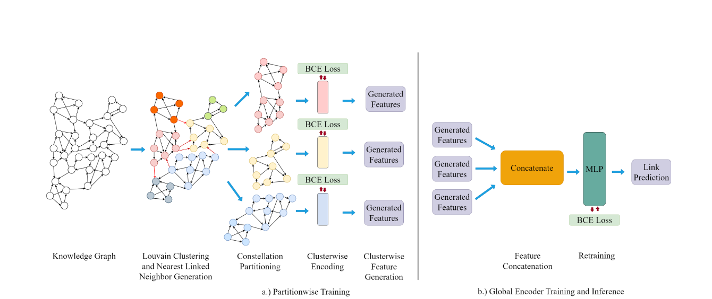

<div align="center">
<h1>CPa-WAC: Constellation Partitioning-based Scalable Weighted Aggregation Composition for Knowledge Graph Embedding</h1>


</div>

This is the official implementation of the paper ["CPa-WAC: Constellation Partitioning-based Scalable Weighted Aggregation Composition for Knowledge Graph Embedding"]([LINK]).

&nbsp;


## Table of contents

   * [Installation](#requirements)
   * [Directory Structure](#directory-structure)
   * [Preparing datasets](#preparing-datasets)
   * [Preparing Clusters](#preparing-clusters)
   * [Running Encoder](#runnning-encoder)
   * [Running Decoder](#runnning-decoder)
   * [License](#license)
   * [Citation](#citation)

## Installation

```
git clone https://github.com/ganzagun/CPa-WAC.git
cd CPa-WAC

virtualenv cpa_wac_env
source cpa_wac_env/bin/activate
pip install -r path/to/requirements.txt
```


## Directory Structure
Structure of the repository directory is as follows
```
ckpt
|-- data
    |-- FB15
        |-- cluster_c2
        |-- ...
    |-- FB15K
        |-- cluster_c2
        |-- ...
    |-- WM18
        |-- cluster_c2
        |-- ...
    |-- WM18RR
        |-- cluster_c2
        |-- ...
|-- model
    |-- Conv_new.py
|-- torch_scatter
    |-- ...
|-- CPa_WAC_clustering.py
|-- KGconstellation_decoder.py
|-- KGconstellation_encoder.py
|-- data_loader.py
|-- helper.py
|-- utils.py

    
```


## Preparing datasets
To run experiments for dataset used in the paper, please download all the datasets and put them under `data/`. Following datasets are present
  * FB15K
  * FB15K-237
  * WN18
  * WN18RR


## Preparing Clusters
Different clusters for a required dataset can be created using the following, hyperparameters(**beta, deta, gamma, sigma**) can be the same used in the paper to replicate the results. While cluster_folder identifies the folder name under which all clusters will be made in `data/` folder
```
python CPa_WAC_clustering.py --dataset WN18RR --beta 200 --delta 40 --gamma 1 --sigma 18000 --cluster_folder cluster_c2
```


## Running Encoder 
In order to run the encoders for a given cluster (specified by **--cluster_num**) use the following script, this will generate embeddings for all clusters and save them. The parameter **--cluster_num** signifies the cluster for which we need to run the encoder. 
```
python KGconstellation_encoder.py --dataset WN18RR --cluster_folder cluster_c2  --cluster_num 2
```


## Running Decoder
Once embeddings are generated for all the clusters, use the below command to run the decoder. The parameter **--cluster_total** signifies the total number of clusters.
```
python KGconstellation_decoder.py --dataset WN18RR --cluster_folder cluster_c2  --cluster_total 2 
```

## License
For license details, see [LICENSE](LICENSE). 

## Citation

If you find our work useful, please cite the following paper:

```
@inproceedings{modal2024cpawac,
  author="Sudipta Modak1 and Aakarsh Malhotra2 and Sarthak Malik and Anil Surisetty and Esam Abdel-Raheem1}",
  title="CPa-WAC: Constellation Partitioning-based Scalable Weighted Aggregation Composition for Knowledge Graph Embedding",
  booktitle="IJCAI",
  year="2023"
}
```
